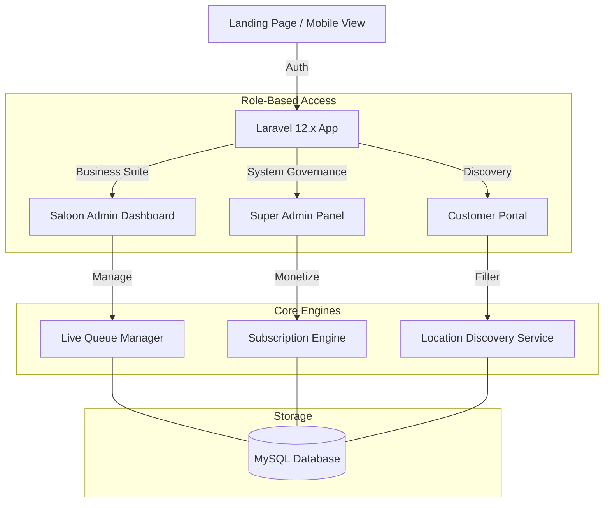

# ✂️ Saloon Management & Live Queue System

[](https://laravel.com)
[](https://www.php.net/)
[](https://www.mysql.com/)
[](https://stripe.com/)

A high-end, enterprise-ready **Saloon Management System** designed to transform the salon experience. This platform features a proprietary **Live Queue Management** engine and a **Stripe-powered Subscription** model, providing a frictionless journey for Super Admins, Saloon Owners, and Customers.

---

## 🏗️ System Architecture

Our system is designed for high availability and role isolation, ensuring a seamless flow between business management and customer engagement:



---

## ✨ Key Features

### 👔 Super Admin Command Center
*   **Platform Governance**: Complete oversight of all registered saloons, verification workflows, and global system analytics.
*   **Monetization Control**: Manage Silver, Gold, and Platinum subscription tiers and monitor platform-wide revenue.
*   **Data Isolation**: Secure multi-tenancy architecture ensuring individual saloon data remains private and protected.

### 🏢 Saloon Operations Suite
*   **Live Queue Management**: Real-time token generation with "People ahead" and "Estimated Wait Time" feedback for customers.
*   **Revenue Engine**: Self-recharge via **Stripe** or UPI QR. Automatic "Temporarily Closed" logic for expired subscriptions.
*   **Business Intelligence**: Automated tracking of daily revenue, popular services, and staff performance metrics.

### 👤 Premium Customer Experience
*   **Intelligent Discovery**: Advanced location-based filtering (State/City) with subscription-driven prioritization for top saloons.
*   **Wait-Free Booking**: Virtual token system allows customers to join queues remotely and track their status in real-time.
*   **Editorial Design**: A modern, glassmorphic UI built for aesthetics and speed across all device types.

---

## 🛠️ Application Ecosystem

| Component | Responsibility | Primary Tech |
| :--- | :--- | :--- |
| **Queue Engine** | Token generation and real-time wait-list tracking | Custom Laravel Logic |
| **Payment Hub** | Multi-tier subscriptions and recharge processing | Stripe API |
| **Auth System** | Triple-role (S-Admin/B-Admin/User) security | Laravel Breeze |
| **Asset Hub** | Vite-powered high-performance visual delivery | Vite 6+ |
| **Logic Layer** | Business rules, buffers, and session archiving | Laravel 12.x |
| **Storage Hub** | Saloon profiles, services, and live queue logs | MySQL |

---

## 🚀 Getting Started

### 1. Prerequisites
Ensure your environment meets the modern requirements:
*   **PHP 8.2+** & **Composer**
*   **Node.js 18+** & **npm**
*   **MySQL Database**

### 2. Rapid Setup (Automated)
We have included scripts to handle the entire installation process in one click.

For Windows Users:
```bash
setup.bat
```

For Linux/Mac Users:
```bash
chmod +x setup.sh
./setup.sh
```

### 3. Manual Installation
If you prefer building step-by-step, first clone the repository:
```bash
git clone https://github.com/vipultikhe234/Saloon-Management-System.git
cd saloon-system
```

Install the PHP and Node dependencies:
```bash
composer install
npm install
npm run build
```

Configure your environment settings:
```bash
cp .env.example .env
php artisan key:generate
```

Initialize the database:
```bash
php artisan migrate:fresh --seed
```

### 4. Demo Credentials
| Role | Email | Password |
| :--- | :--- | :--- |
| **Super Admin** | `admin@saloon.com` | `password` |
| **Saloon Admin** | `saloon@saloon.com` | `password` |
| **Customer** | `user@saloon.com` | `password` |

---

## 🔒 Security Configuration
The project is built with high-availability security standards:
*   **Role Isolation**: Strict middleware preventing access across Super Admin and Saloon Admin domains.
*   **Subscription Enforcement**: Automated database triggers to disable features for unpaid accounts.
*   **Fraud Protection**: Verified QR and Stripe session checking for all financial transactions.

---

## 📂 Project Structure
```text
.
├── app/Http/Controllers/  # Logic split (SuperAdmin, SaloonAdmin, User)
├── database/migrations/   # 17+ Optimized tables for scale
├── resources/views/       # Premium Blade UI (Multi-panel)
├── routes/web.php         # Secure, role-based routing definitions
└── setup.bat / setup.sh   # Automated deployment scripts
```

---

## 🛡️ License
Distributed under the MIT License. See `LICENSE` for more information.

---

Developed with ❤️ by **[Vipul Tikhe](https://github.com/vipultikhe234)**